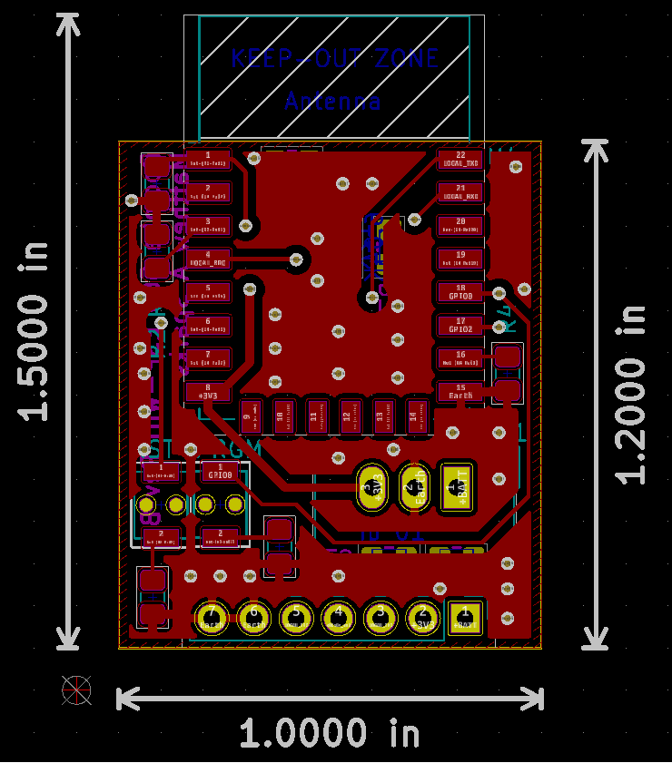
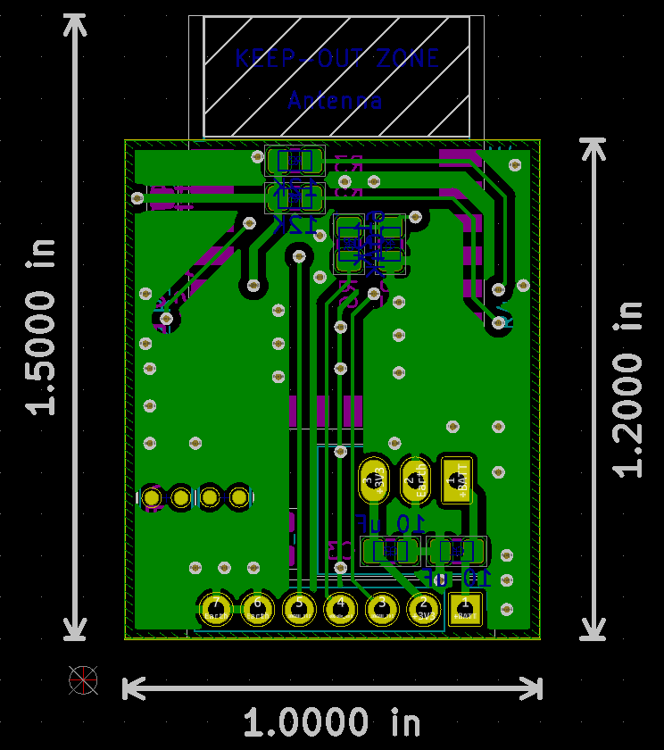
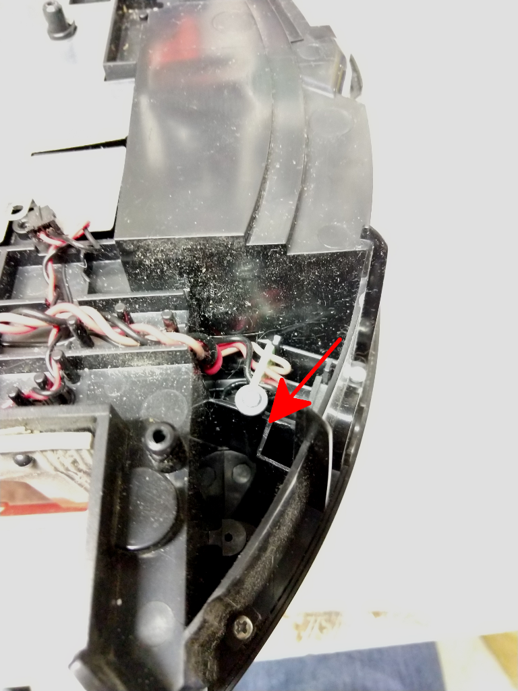
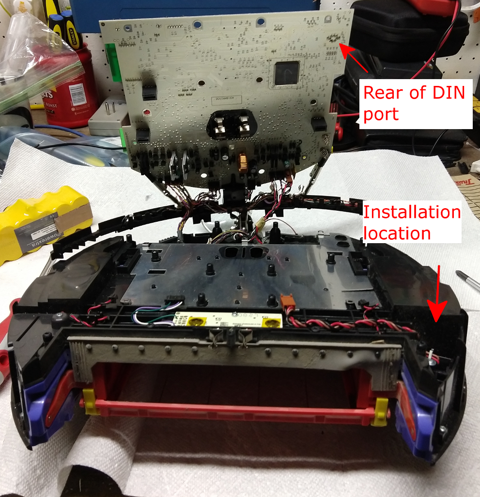
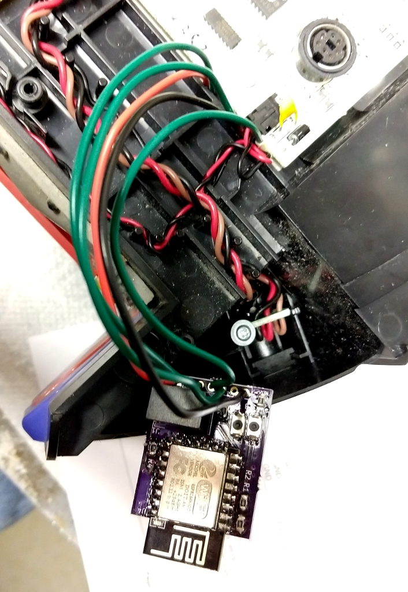
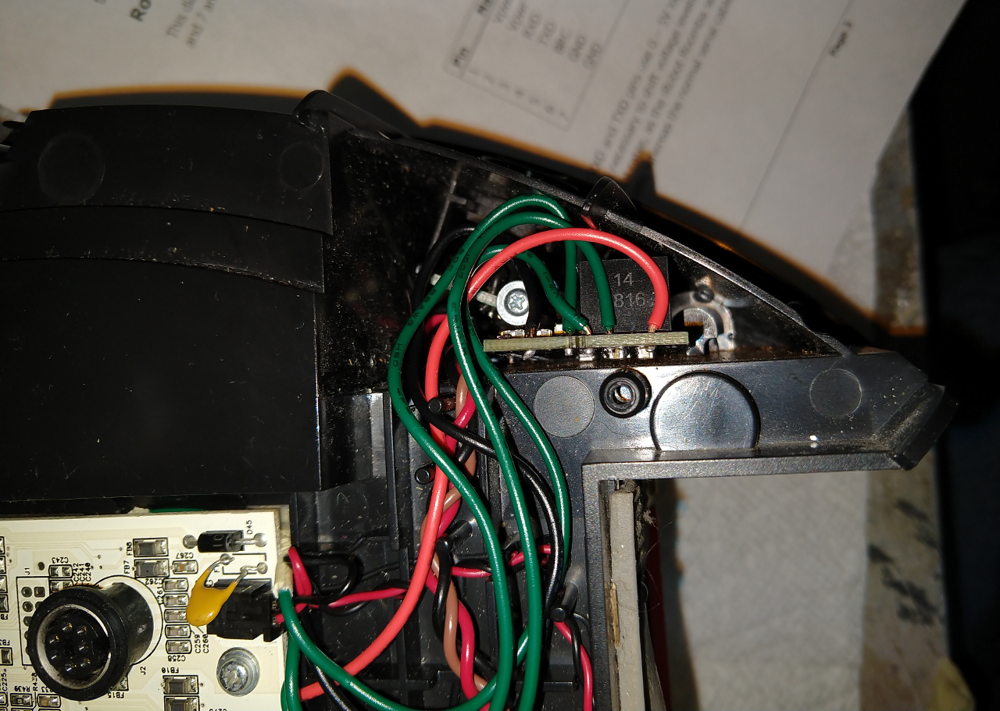

# roomba_esp_wifi
Board for adding wifi using ESP-12 to Roomba 500/600 series.

## Overview

This project describes a board with an ESP-12 microcontroller and the following interfaces:
* UART - 3.3V, 5.0V tolerant
* Battery input - supports 4.75V - 36V
* GPIO - single pin at 3.3V
* 3.3V auxiliary output

It is intended for use with [esp-roomba-mqtt by John Boiles](https://github.com/johnboiles/esp-roomba-mqtt), but may also be suitable for general use in battery-powered applications.

## Layout
 

## Parts

| Quantity | Part Description       | Suggested Part Number |
| -------- | --------------------   | --------------------- |
|        1 | ESP-12E or ESP-12F     | N/A                   |
|        2 | Small push buttons     | PTS820J15MSMTRLFS     |
|        2 | Resistor, 470Ω, 0805   | ERJ-6ENF4700V         |
|        6 | Resistor, 12KΩ, 0805   | ERJ-6ENF1182V         |
|        1 | Resistor, 6.04KΩ, 0805 | ERJ-6ENF6041V         |
|        2 | Capacitor, 10µF, 0805  | C0805C106K3PAC7800    |
|        1 | 1x7 100mil header (optional)      | PPPC071LFBN-RC        |
|        1 | 3.3V DC-DC Converter     | TSR 1-2433     |

## Programming

This board can be intially programmed in a similar fashion to a NodeMCU using your preferred Arduino programmer, but does require manual control using the PRGM and RST buttons.  If using esp-roomba-mqtt, it may be programmed over Wifi after the initial flash.

## Installation

The board is designed to fit inside a Roomba 560 behind the starboard wheel well.  It is recommended to solder wires between the board and the rear of the Roomba Mini-DIN port to avoid having a Mini-DIN plug sticking up from the Roomba.

### Installation location on Roomba 560

### Board wired in

### Final installation

